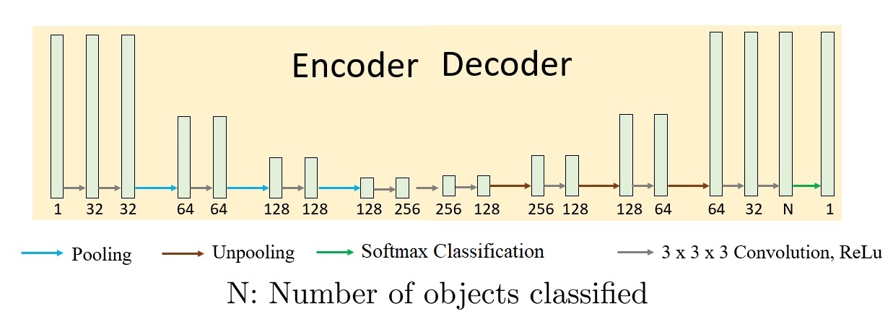

# Cardiac CINE MRI Segmentation
 
## Introduction
Analysis of cardiac function plays an important role in clinical cardiology for patient management, disease diagnosis, risk evaluation, and therapy decision. Thanks to digital imagery, the assessment of a set of complementary indices computed from different structures of the heart is a routine task for cardiac diagnostics. Because of its well known capacity for discriminating different types of tissues, Cardiac MRI (CMR) (built from series of parallel short axis slices) is considered as the gold standard of cardiac function analysis through the assessment of the left and right ventricular ejection fractions (EF) and stroke volumes (SV), the left ventricle mass and the myocardium thickness. This requires accurate delineation of the left ventricular endocardium and epicardium, and of the right ventricular endocardium for both end diastolic (ED) and end systolic (ES) phase instances. In clinical practice, semi-automatic segmentation is still a daily practice because of the lack of accuracy of fully-automatic cardiac segmentation methods. This leads to time consuming tasks prone to intra- and inter-observer variability. In this project, I propose a Deep learning (DL)-based algorithm for segmenting myocardium and both the ventricles in cardiac MRI. DL algorithms are good at automatically discovering intricate features from data for object detection and segmentation. These features are directly learned from data using a general-purpose learning procedure and in end to-end fashion. This makes DL-based algorithms easy to apply to other image analysis applications.

In this project I investigate the problem of semantic segmentation of time series of cardiac CINE MRI volumes. I study the segmentation performance of two state-of-the-art neural network architectures 3D Autoencoder(AE) and 3D UNET. The problem is challenging since the datasets are huge and collected from 100 patients with different kind of heart conditions. These patients are also scanned in different MRI scanners with different scanning parameters giving rise to variation in contrast. Overall, the UNET is found to be better performing than AE. The semantic segmentation helps the medical experts to compute ejection fraction of a patient which explains any abnormality in heart functioning.

## Dataset
I obtain cardiac MRI data from the MICCAI 2017 ACDC challenge https://acdc.creatis.insa-lyon.fr/. It consists of cardiac CINE MRI of 100 patients with ground truth segmentation done by experts. The acquisitions were obtained over a 6 year period using two MRI scanners of different magnetic strengths (1.5 T (Siemens Area, Siemens Medical Solutions, Germany) and 3.0 T (Siemens Trio Tim, Siemens Medical Solutions, Germany)). Cine MR images were acquired in breath hold with a retrospective or prospective gating and with a SSFP sequence in short axis orientation. Particularly, a series of short axis slices cover the LV from the base to the apex, with a thickness of 5 mm (or sometimes 8 mm) and sometimes an interslice gap of 5 mm (then one image every 5 or 10 mm, according to the examination). The spatial resolution goes from 1.37 to 1.68 mm2/pixel and 28 to 40 images cover completely or partially the cardiac cycle (in the second case, with prospective gating, only 5 to 10% of the end of the cardiac cycle was omitted), all depending on the patient.

The 100 patients are evenly divided into 5 classes with well-defined characteristics according to physiological parameters. The different subgroups are given hereunder:

NOR: Examination with normal cardiac anatomy and function. The ejection fraction is greater than 50%, the wall thickness in diastole is lower than 12 mm, the LV diastolic volume is below 90 mL/m2 for men and 80 mL/m2 for women.

MINF: Patients with a systolic heart failure with infarction. Subjects have an ejection fraction below 40% and abnormal myocardial contractions. Some subjects have a high diastolic LV volume due to a remodeling of the LV to compensate for the myocardial infarction.

DCM: DCM: Patients with dilated cardiomyopathy have an ejection fraction below 40%, a LV volume greater than 100 mL/m2 and a wall thickness in diastole smaller than 12 mm. As a consequence of dilated LV, some patients of this category have a dilated RV and/or a high LV mass.

HCM: Patients with hypertrophic cardiomyopathy, i.e. a normal cardiac function (ejection fraction greater than 55%) but with myocardial segments thicker than 15 mm in diastole. In this category, patients can present abnormal cardiac mass indices with values above 110 g/m2.

ARV: Patients with abnormal right ventricle have a RV volume greater than 110 mL/m2 for men, and greater than 100 mL/m2 for women, or/and a RV ejection fraction below 40%. Almost every subject in this subgroup has a normal LV.


## Architecture description
To experiment with this dataset, I am looking at 3D UNET and 3D Autoencoder (AE) network architectures.
### 3D Autoencoder
The 3D Autoencoder archotecture is shown below in Figure 1. There are 15 layers represented by green pillars. Each green pillar is a convolution layer. The number below the pillars denote output channels of the layer. So, the input image has single channel that grows to 32 followed by 64 and all the way to 256 at the end of encoder. Similarly, the decodes grows it back to N=3 from 256. Here N=3 since I am segmenting 3 structures namely Left ventricle(LV), Right ventricle(RV) and myocardium. After getting N channel output, the network uses softmax layer to get N probability maps and then the class with higher probability is assigned to the pixel. Thus, the network learns N probability maps for eavery pixel in the volume. The network consists of 2 x 2 max pooling operation in the encoder block and 2 x 2 unpooling operation using nearest neighbour interpolation. These operations are indicated by different colored arrows shown here.



### 3D UNET
The 3D UNET archotecture is shown below in Figure 2. The network has architecture similar to 3D Autoencoder described above. It has 15 layers too with same number of trainable parameters. The difference with autoencoder is the skipped connection in black arrows. The encoding layer outputs are concatenated to the corresponding decoding layer outputs of similar size. The pooling and unpooling operations are same in this case. The UNET gives N=3 number of probability maps using softmax layer and then the pixels are assigned to the class with highest probability. The embedding of the downsampled outputs with upsampled outputs boosts performance over 3D autoencoder. This is because the global features of images are extracted by encoder through pooling operation which are combined with upsampling layers in decoder. The global features are preserved much better in this way.


## Description of Python Scripts
The codes have been written in python-3.7 using the Pytorch-v1.3.0 library.

```trn_3DAE.py``` : Training script for the 3D Autoencoder

```trn_3DUNET.py``` : Training script for the 3D UNET

```tst_3DAE.py``` : Testing script for the 3D Autoencoder

```tst_3DUNET.py``` : Testing script for the 3D UNET

```Auto3D_D4.py``` : A script defining Autoencoder model

```UNET3D_D4.py``` : A script defining UNET model

```tst_dataset.py``` : A script for testing dataset creation

```train_val_dataset.py``` : A script for training and validation dataset creation

The trained models can be found on the google drive link: https://drive.google.com/drive/folders/1GdT2eqSDOmtiqchZ8pXj0oi0RAB3eMXO?usp=sharing


## Results
I show results for End Diastolic (ED) and End Systolic (ES) frames of a normal person and a DCM (dilated myocardiopathy) patient. The result in Figure 3 is that of a normal patient and Figure 4 is the result of a DCM patient. The yellow region is Right ventricle (RV), light blue region is Left ventricle (LV) and the deep blue region is myocardium (MYO). The middle column respresents 3D AE segmentation while the right row shows 3D UNET segmentation and the left row shows ground truth segmentation by experts.

Analysis:

NOR (normal person): It is evident from the figure below that the myocardium wall is much thicker for 3D AE segmentation compared to the ground truth. This leads to decrease in accuracy an Dice coefficient. On the other hand, UNET has captured the shape and thickness of myocardium better than AE. It can be due to the skipped connections preserving shape of it. The complex edges of the LV and RV are better captured by UNET than AE. The edges of LV and RV reported by 3D AE looks much smoother whereas UNET captures intricate variations in the boundaries.


DCM (dilated myocardiopathy): There are similar observations from the figure below. The AE thickens the myocardium wall which is undesirable and reduces accuracy. Also the complex edges of the ventricles are better captured by UNET. The UNET preserves the intricate details in the myocardium boundaries whereas AE completely smoothens it like a circle. The RV region seems bigger in AE segmentation than the ground truth which might mislead the experts for ejection fraction calculation.


## Conclusion
I did a comparative study of the segmentation (semantic classification) performance of the standard 3D UNET and 3D Autoencoder on cardiac time series CINE MRI. Although these two network architectures have been used for cardiac MRI segmentation before but those used to be on smaller datasets. I leveraged these networks for training and testing of their performance on a wide variety of subjects with five different possible cardiac abnormalities. It is more challenging task for both the networks since there is a lot of variation in the datasets from patient to patient in terms of contrast, location of heart structures of interest like left ventricle, right ventricle and myocardium.

The cardiac MRI datasets also differed in contrast from patient to patient since they were scanned in different MRI scanners with different scanning parameters. Some of the patients had heart aligned vertically while some had aligned horizontally. So, there were several variations across the datasets and coupling those with augmentation strategies helped me to make both the networks robust and more generalizable for patients with various heart conditions scanned with different type of MRI scanners.

After tuning hyperparameters and training on this large dataset I found UNET to be outperforming the autoencoder architecture. Both the networks have an encoder that down samples the input image and learns a lower dimensional vector representation of the family of such input images. This lower dimensional vector is upsampled in multiple layers and mapped to its corresponding ground truth label. Both have similar structures but UNET uses skipped connections from encoder to decoder to merge encoding information along with decoding operation. This gives performance boost over the Autoencoder.


## Contact
The code is meant for reproducible research. In case of any difficulty, please open an issue or directly email me at aniket-pramanik@uiowa.edu
